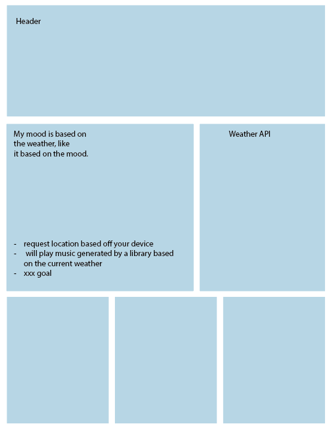

# Mother-Music

Feeling some kind of way? Whether you are happy, sad, bored, or somewhere in between, Mother-Music has the perfect playlist for you. This is a simple playlist generator integrates your Spotify account, and allows you to leave your feedback on playlists and interact with other listeners, creating a community of music enthusiasts. 

## Table of Contents

- [Description](#description)
- [Introduction](#introduction)
- [Process](#process)
- [Features](#features)
- [Usage](#usage)
- [Installation](#installation)
- [Credits](#credits)
- [Licenses](#licenses)
- [Images](#images)
- [Link To Deployed Webpage](#link-to-deployed-webpage)
- [Link to GitHub Pages ](#link-to-gethub-website)

## Description

Mother-Music as a playlist generator that integrates the Spotify API and OpenWeather API. By using the Spotify API, the app connect to Spotify services to pull music, while OpenWeather API users the user's latitude and longitute to determine the current weather, and provide contextual music recommendations. Users can log in using their Spotify accoutns to save playlists to a personal library, and remember their location. 

## Introduction

This is the collaborative effort of Mason Carr, Kailee Segarra, and Stephanie Zolton, developed as part of our bootcamp. Mother-Music represents a full-stack application that leverages both front-end and back-end developement including Handlebars, Node.js, Express.js, and Sequelize.

## Process

Intial brainstorming: 
- Music library database w/o copyrights
- Event tracker for concerts/sports/comedy
- Daily personalized song recommendations based on mood
- Music playlists based on weather
- Weather tracker for conters/outdoor events

Final Proposal:

Title: Mother Music

Proposal description: An application that provides personalized playlist recommendations based on weather. However, we adjusted our focus on creating a playlist generator where users can listen to music, leave comments, and interact with other users.

User story: 
AS A Spotify user, 
I WANT an app that allows me to interact with my favorite music through curated playlists 
SO THAT I can connect with others who share  a similar taste in music.

Initial APIs explored:
https://rapidapi.com/s.mahmoud97/api/concerts-artists-events-tracker/ 
https://developer.mozilla.org/en-US/docs/Web/API/Geolocation_API/Using_the_Geolocation_API#examples 
https://developer.mozilla.org/en-US/docs/Web/API/Geolocation_API
https://rapidapi.com/Paxsenix0/api/youtube-music-api3/
https://rapidapi.com/category/Music
https://rapidapi.com/sonoteller1-sonoteller-default/api/sonoteller-ai1/
https://leemartin.dev/turning-weather-into-music-with-dark-sky-and-spotify-for-tycho-f4f40aef97ed 

Future Development:
- Support for finding records and vinyls of your favorite artists: https://rapidapi.com/mail.munteanu/api/yourvinylstore/ 
- Notifcations for local artist events
- Enhanced user profiles that allow for customization
- Develop a mobile verison of the application

Our initial wireframe:

Sources and Learning Materials:
- Class challenges, mini-projects
- Rewatched live class session
- Collaboration with teachers, TAs, tutors
- YouTube resources: https://www.youtube.com/watch?v=wSNa5b1mS5Y.

Challenges: 
- Started with 4 developers, but lost a developer, requiring redistribution of workload
- Deployment issues with Heroku
- Time constraints
- favicon ico

## Features

- Uses Handlebars (HBS) template for front-end, and Node.js and Express.js for back-end. 
- Allows user interaction via comments on playlists, songs, artists
- Generates personalized playlists
- Integrates Spotify API

## Usage

Log in with your Spotify account to create personalized playlists, leave comments, and connect with other music enthusiasts. 

## Installation

1. Clone the repository
2. Install dependencies: npm install
3. Set up the database: MySQL/Sequelize schema
4. Configure environment variables for Spotify API and OpenWeather API
5. Deploy using Heroku

## Credits

Special thanks to our teacher, Mr. Ragheed, and assistant teacher, Mr. Ragheed and Mr. Torres, for giving us the necessary guidance to understand the coding languages. Thank you to Ohio State University for creating the Coding Bootcamp.

## Licenses

Please refer to License in repo.

## Link to Deployed Webpage

[Heroku](https://mother-music-b890c71f6170.herokuapp.com/)
 
## Link to GitHub Website

[Repository](https://github.com/Masonmanshark4/Mother-Music)
